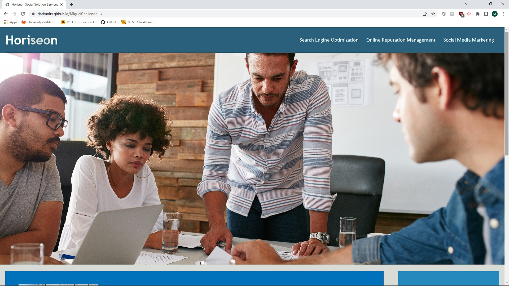
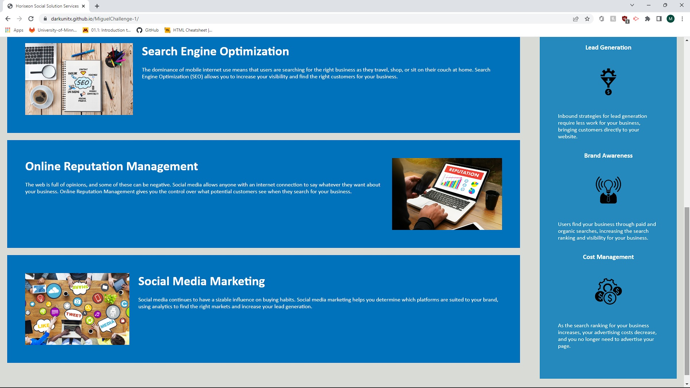

# Challenge number #1

## Description 
This is the very first Website that i have optimized and cleaned up. I did not start this project from scratch skince a skeleton has previously been created however i have modified various parts of the website including fixing links, making sure that it meets accesibility standards, the elements follow a logical structure independent of styling and positioning and verifying that i have used everything that i've learnt in class so far and applied all of that knowledge here. I have modified the project to test my skills and capabilities with HTML and CSS and to show the world and myself what i am truly capable of. I learnt a lot during the creation/optimization of this website such as the different types of elements and attribute tags in HTML and CSS but most importantly why it's important to keep projects simple and easy to read.

## Table of contents
## Usage
## Credits 

- In collaboration with : 
- Miguel Montenegro  https://github.com/Darkunitx
- Nicholas Mamberger https://github.com/NickHM05
- Saiadhuddin Asim   https://github.com/Sal8298

## License

## Screenshot

  
  

